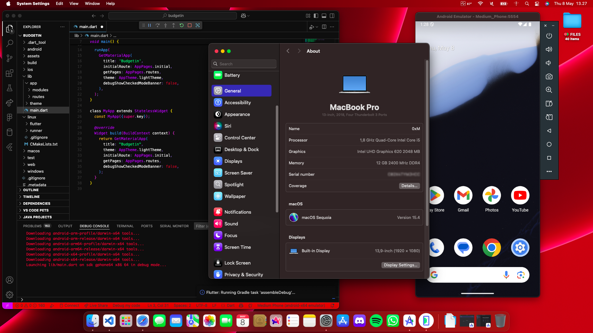
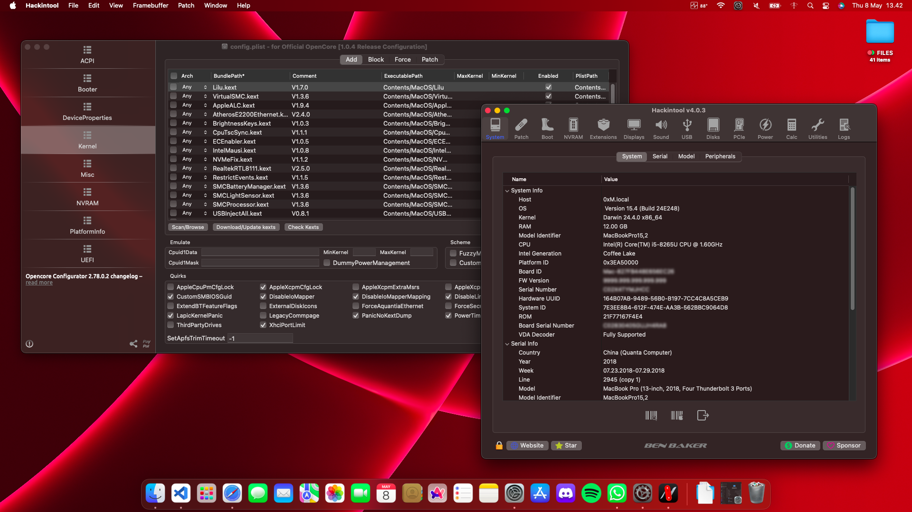

# EFI for ASUS X409FJ

This EFI guide summarizes the hardware specifications and functionality of the **ASUS X409FJ** running **macOS Big Sur 11.7** with **OpenCore r1.0.4**.

## Specifications

- **Processor**: Intel Core i5-8265U
- **RAM**: 12GB DDR4 (2400MHz)
- **GPU**: Intel UHD 620 (8th Gen)
- **Storage**: 512GB Intel SSD
- **Touchpad**: ELAN ELAN1200 (I2C)
- **Audio**: Realtek ALC256
- **Wi-Fi/Bluetooth**: Intel AC 9461
- **Ethernet**: None
- **Display**: 13.9" Full HD (1920x1080)
- **Bootloader**: OpenCore r0.6.5

## Working

- **Power Management**: Fully functional.
- **Shutdown, Restart, Sleep**: All work as expected.
- **Graphics (QE/CI)**: Full acceleration (Intel UHD 620).
- **Audio**: Internal speakers, mic, and external audio devices work.
- **Touchpad**: Fully functional with gestures.
- **Battery**: Indicator and management are working.
- **Brightness Control**: Up/Down buttons and adjustment work.
- **HDMI**: Video and audio output via HDMI.
- **Wi-Fi/Bluetooth**: Intel AC 9461 works with **itlwm** kext.
- **USB Ports**: All ports function properly.

## Not Working

- **Ethernet**: Not available (no Ethernet port).
